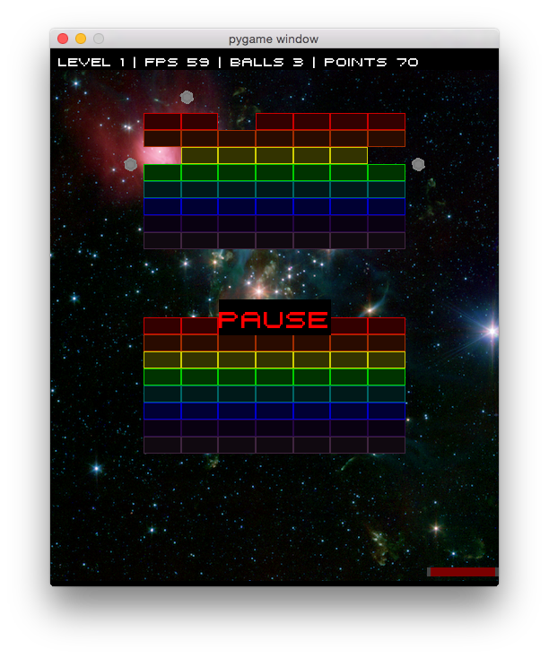
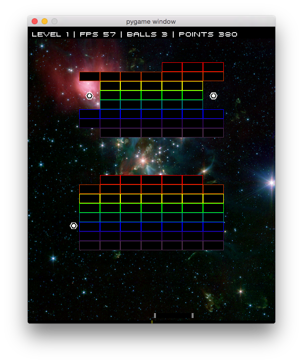

# Breakout

[Breakout](http://en.wikipedia.org/wiki/Breakout_%28video_game%29) game engine implemented in Python, [PyGame](http://pygame.org/) and OpenGL.

I've recorded a video of this game running. You can watch it [here](https://vimeo.com/118087355). Scroll-down for screenshots.

# Requirements

- Python 2.7 or above (does not support Python 3.x)
- Ubuntu Linux or Mac OS X (should work on any recent versions)
- PyGame
- PyOpenGL
- libvorbis (OGG support, installed by default on Ubuntu Linux)
- Enum34 (Python 3.4 enum support backported to 2.7)
- PyTest (to run automated unit tests)

## Ubuntu Linux Setup

Tested on Ubuntu 12.04

     sudo apt-get install python-opengl
     sudo apt-get install python-pygame
     pip install -r source/requirements.txt
     
## Mac OS X Setup

Tested on Mac OS X 10.10 Yosemite.

You need to have [Homebrew](http://brew.sh) and [Python 2.7](http://docs.python-guide.org/en/latest/starting/install/osx/) properly installed.

    brew install Caskroom/cask/xquartz
    brew install libvorbis && brew reinstall sdl_mixer
    brew install pygame
    pip install -r source/requirements.txt
     
# Running the Game

Enter the 'source' directory and execute script 'run.sh'.

# Running Automated Unit Tests

Execute inside the 'source' folder:

    py.test

# Screenshots

